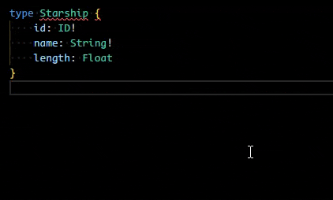

  

# 📦 GraphQL to NestJS Generator

**A VS Code extension that converts GraphQL SDL (Schema Definition Language) blocks into NestJS Code-First TypeScript code — directly in place.**

This tool replaces selected SDL blocks with ready-to-use NestJS code for types, inputs, enums, queries, mutations, and subscriptions.

 

# ✨ Features

✅ In-Place Code Conversion - Select GraphQL SDL in your editor, run the extension, and instantly replace it with NestJS-compatible TypeScript code.

✅ Type Conversion - SDL `type` → NestJS `@ObjectType()` class.

✅ Input Conversion - SDL `input` → NestJS `@InputType()` class.

✅ Enum Conversion - SDL `enum` → TypeScript `enum`.

✅ Query & Mutation Generation - SDL `type Query` and `type Mutation` → NestJS `@Query()` and `@Mutation()` methods inside a resolver class.

✅ Subscription Generation - SDL `type Subscription` → NestJS `@Subscription()` method stubs.

✅ Code-First Ready - Generated code uses decorators like `@ObjectType()`, `@InputType()`, `@Field()`, `@Args()`, `@Query()`, `@Mutation()` and `@Subscription()` ensuring full compatibility with NestJS’s code-first GraphQL setup.

 

# 🚀 Usage

- Select the SDL block you want to convert in your editor.
- Run the extension by using one of the following approach
  - Press the shortcut `Shift + Alt + N`
  - Run the command `Generate NestJS Code from GraphQL`
  - Select `Generate NestJS Code from GraphQL` from the context menu
- The selected SDL block will be replaced with NestJS code

# 💬 Feedback & Contributions

Have suggestions, bug reports, or feature requests? Open an [issue](https://github.com/spsesha/graphql-to-nestjs-generator/issues) or submit a pull request on the [GitHub repository](https://github.com/spsesha/graphql-to-nestjs-generator).
